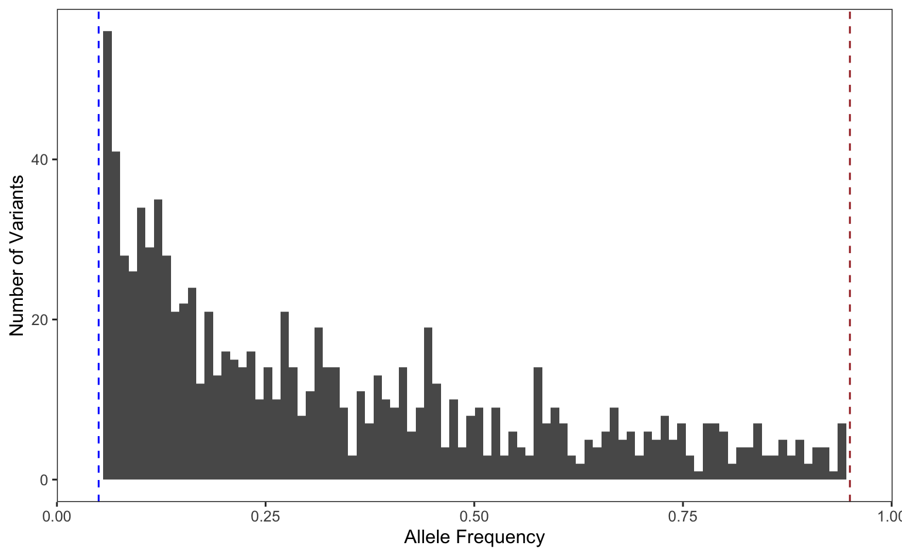
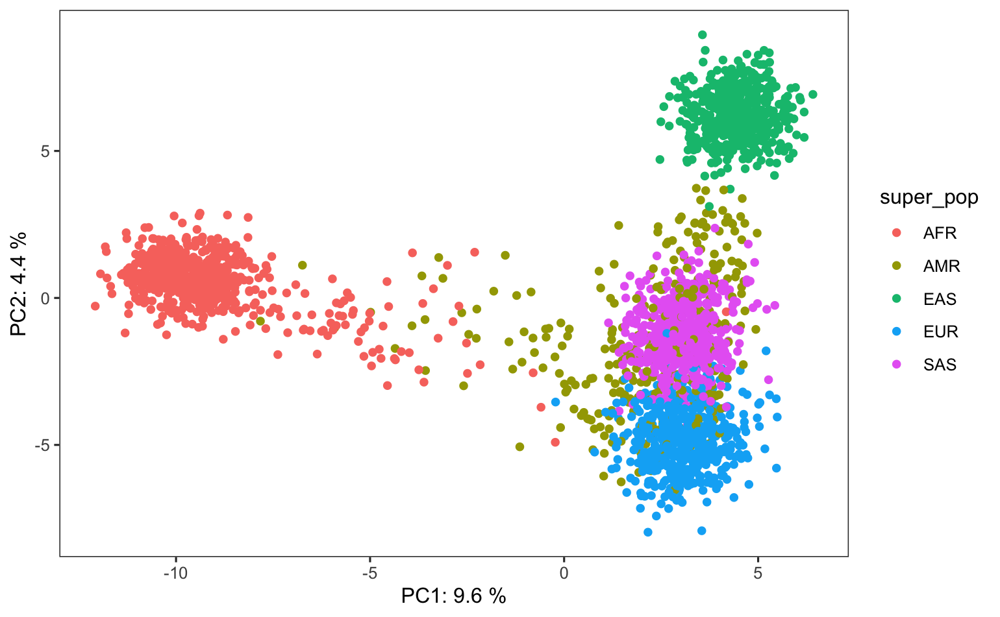

# Conclusion: Looking Ahead

## Learning Objectives

After going through this module, students should be able to:

* Describe how they will use the Python skills they've practiced within these prepwork modules during Quantitative Biology Bootcamp

## Looking ahead to next steps

These prepwork modules were intended to give you a brief exposure to the fundamentals of the Python programming language. Within the modules you worked with a `.vcf` (or variant call format) file that contained data specific to genetic variants. [As explained by this resource](https://www.internationalgenome.org/wiki/Analysis/Variant%20Call%20Format/vcf-variant-call-format-version-40/), a`.vcf` file has a multi-line metadata header, a data header line, and then data lines. 

The **metadata header lines** start with `##` and provide meta-information specific to the file such as the VCF format version number, when the file was created, what source made the file, if it was quality checked, etc. These lines also may include descriptions of the FILTER, INFO, and FORMAT columns in the data lines. For example, the INFO column likely includes entries for several pieces of information such as the variant's allele frequency, population specific estimates of the variant's allele frequency, etc. Each piece of information that is provided in the INFO column will have its own description line in the metadata header. 

The **data header line** starts with `#` and lists at least the 8 required columns for a VCF file. It may include the FORMAT column if genotype data is included in the file. If genotype data is included, it'll also list the sample/individual IDs. 

There are multiple **data lines**. Each data line has information pertaining to a single variant. There is required info about variant location, identity, etc. and, depending on the file, the data lines may or may not contain genotype information for specific samples or individuals. The required columns are 

* CHROM -- the chromosome where the variant occurs
* POS -- the position at which the variant occurs
* ID
* REF -- the reference base(s) of the allele
* ALT -- the alternate non-reference allele(s) called on at least one o the samples 
* QUAL
* FILTER
* INFO -- the additional info entries discussed earlier like allele frequency, etc.

If genotype information is provided for samples, these will be included after the FORMAT column, with a column for each included sample.

For the file that you used within these prepwork modules, genotype information was included for 10,000 genetics variants across 2548 samples. 

* 0|0 corresponds to a sample being homozygous reference for a variant
* 0|1 or 1|0 correspond to a sample being heterozygous alternate for a variant
* 1|1 corresponds to a sample being homozygous alternate for a variant

In addition to providing each sample's genotyping information for each variant, the estimated allele frequency of that variant within the population is included. 

Using the Python skills that you have practiced and more that you will learn in Quantitative Biology Bootcamp, you will learn to further parse a `.vcf` file, extracting and visualize specific information like the allele frequencies and genotyptes to make allele frequency histograms and PCAs of the genetic variation:

The skills that you learn throughout Quantitative Biology Bootcamp will help you gain comfort and skills working with many other bioinformatic data files beyond just this `.vcf` file. Upon completing the course, students should be comfortable using and writing software to work with large-scale biological data. The motivation of this goal is to develop computational and statistical competence in preparation for courses, rotations, thesis research, and careers. Rather than blindly outsourcing bioinformatic components of their work, students will be empowered to understand methodological details and their associated advantages and limitations. This will in turn advance the broader goal of rigor in experimental design, promoting robust and unbiased results.
